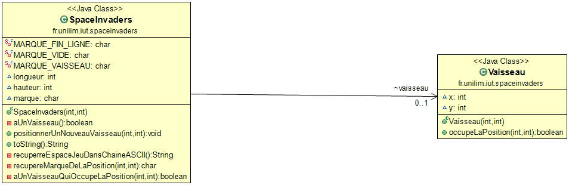

# spaceinvaders

## Semaine 2 : Du 26 Avril au 2 Mai ##
  
  ### Sprints et fonctionnalités réalisées 

 #### Fonctionalité 1 : Déplacer un vaisseau dans un espace de jeu défini : 

   - Story 1 : Définir un espace de jeu (Fini) 
        Nous avons du délimiter un espace de jeu ni trop grand ni trop petit afin de déplacer le vaisseau dans celui-ci.
        L'espace de jeu est rerésenter par une chaine ASCII. 
        
   - Story 2 : Implémenter un vaisseau dans l'espace de jeu : 
        Nous avons du après avoir délimiter l'espace, implémenter et représenter le vaisseau dans l'espace défini. 
        Il occue pour l'instant qu'une seule case de l'espace de jeu 

#### Fonctionnalité en cours d'implémentation :
  
  - Faire déplacer le vaisseau vers la droite :
        Le vaisseau se déplace d'un pas vers la droite 
        Si le vaisseau se trouve sur la bordure droite de l'espace de jeu, le vaisseau doit rester immobile (aucun déplacement, aucune exception levée : le vaisseau reste juste à sa position actuelle).
        
       
       
### Diagramme de classes 

### Nuages de mots 

### Difficultés rencontré 
Aucune 

### Glossaire 
* **Vaisseau** :  véhicule commandé par le joueur, pouvant se déplacer de droite à gauche et ayant la possibilité de lancer des missiles destinés à détruire le(s) envahisseurs.
        
        
        
        
        
        
        
