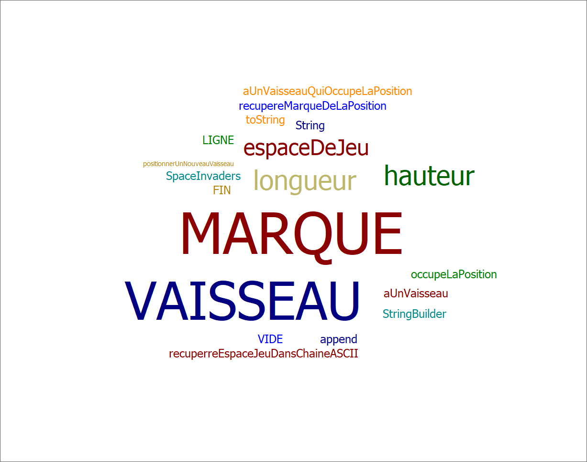
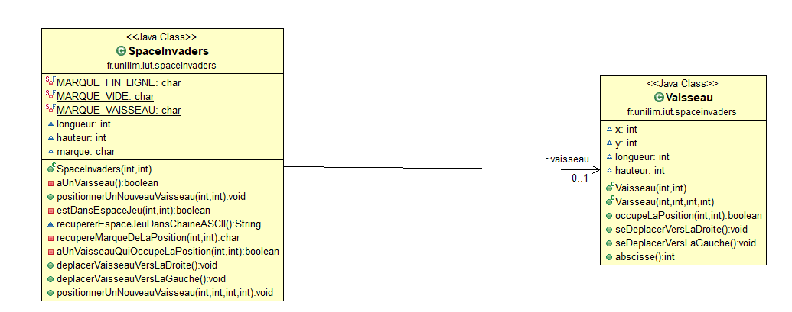
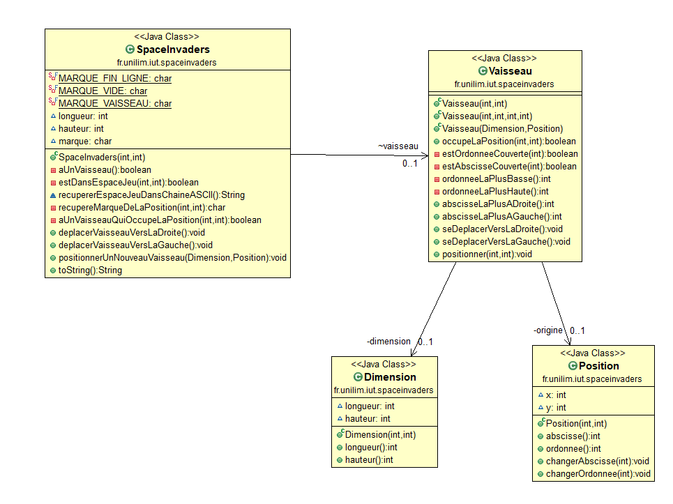

# Space Invaders

## Semaine 2 : Du 26 Avril au 2 Mai 
### Sprints et fonctionnalités réalisées 

 #### Fonctionalité 1 : Déplacer un vaisseau dans un espace de jeu défini : 

   - Story 1 : Définir un espace de jeu (Fini) 
        Nous avons du délimiter un espace de jeu ni trop grand ni trop petit afin de déplacer le vaisseau dans celui-ci.
        L'espace de jeu est rerésenter par une chaine ASCII. 
        
   - Story 2 : Implémenter un vaisseau dans l'espace de jeu : 
        Nous avons du après avoir délimiter l'espace, implémenter et représenter le vaisseau dans l'espace défini. 
        Il occue pour l'instant qu'une seule case de l'espace de jeu 

#### Fonctionnalité en cours d'implémentation :
  
  - Faire déplacer le vaisseau vers la droite :
        Le vaisseau se déplace d'un pas vers la droite 
        Si le vaisseau se trouve sur la bordure droite de l'espace de jeu, le vaisseau doit rester immobile (aucun déplacement, aucune exception levée : le vaisseau reste juste à sa position actuelle).
        
       
       
### Diagramme de classes 

### Nuages de mots 

### Difficultés rencontré 
Aucune 

### Glossaire 
* **Vaisseau** :  véhicule commandé par le joueur, pouvant se déplacer de droite à gauche et ayant la possibilité de lancer des missiles destinés à détruire le(s) envahisseurs.
        

## Semaine 3 : Du 10 Mai au 12 Mai ##

### Sprints et fonctionnalités réalisées 
     
   #### Fonctionalité 1 : Déplacer un vaisseau dans un espace de jeu défini : 
     
   - Story 3 : Déplacer le vaisseau vers la droite dans l'espace de jeu :
        Le vaisseau se déplace d'un pas vers la droite 
        Si le vaisseau se trouve sur la bordure droite de l'espace de jeu, le vaisseau doit rester immobile (aucun déplacement, aucune exception levée : le vaisseau reste juste à sa position actuelle).
        
   - Story 4 : Déplacer le vaisseau vers la gauche dans l'espace de jeu :
        Le vaisseau se dépalce d'un pas vers la gauche 
        Si le vaisseau se trouve sur la bordure gauche de l'espace de jeu, le vaisseau doit rester immobile (aucun déplacement, aucune exception levée : le vaisseau reste juste à sa position actuelle).
       
   ### Fonctionnalité en cours d'implémentation :
   
   #### Fonctionalité 2 : Dimensionner le vaiseau : 
   
   - Story 1 : Positionner un nouveau vaisseau avec une dimension donnée : 
        Le vaisseau n'a plus une dimension de 1 par 1 mais maintenant de 3 par 2 afin d'avoir un rendus plus réaliste (un vaisseau qui fait la même taille qu'un missile n'est pas tout à fait réaliste) 
        
   ### Diagramme de classes 

 
  ### Nuages de mots 
   
        
  ### Difficultés rencontré 
Aucune 

### Glossaire 

* **Vaisseau** :  véhicule commandé par le joueur, pouvant se déplacer de droite à gauche et ayant la possibilité de lancer des missiles destinés à détruire le(s) envahisseurs.
        
* **Missile** :  projectile envoyé à la verticale par le vaisseau vers l'envahisseur dans le but de le détruire.
        
 

## Semaine 4 : Du 17 Mai au 21 Mai ##

### Sprints et fonctionnalités réalisées 

 #### Fonctionalité 2 : Dimensionner le vaiseau : 
 
  - Story 1 : Positionner un nouveau vaisseau avec une dimension donnée : 
        Le vaisseau n'a plus une dimension de 1 par 1 mais maintenant de 3 par 2 afin d'avoir un rendus plus réaliste (un vaisseau qui fait la même taille qu'un missile n'est pas tout à fait réaliste). 
        
  - Story 2 : Faire en sorte qu'il soit impossible de positionner un nouveau vaisseau qui déborde de l'espace de jeu : 
        Maintenant que notre vaisseau à une dimension, il ne faut pas seulement que les coordonnées de notre vaissseau soit en dehors de l'espace de jeu pour qu'il soit en dehors, nous allons donc vérifier si une partie du vaisseau ne soit extétrieure à l'espace de jeu. 
        
  - Story 3 : Déplacer un vaisseau vers la droite en tenant compte de sa dimension : 
        Vu que notre vaisseau à mainteant une dimension, il faut le déplacer vers la droite en tenant compte qu'il est sur plusieurs positions en même temps.
        Si une partie du vaisseau est au bord, le vaisseau ne doit donc ne pas se déplacer (il doit rester immobile).  
        
  - Story 4 : Déplacer un vaisseau vers la gauche en tenant compte de sa dimension : 
        Vu que notre vaisseau à mainteant une dimension, il faut le déplacer vers la gauche en tenant compte qu'il est sur plusieurs positions en même temps.        
        Si une partie du vaisseau est au bord, le vaisseau ne doit donc ne pas se déplacer (il doit rester immobile).
        
  ### Diagramme de classes 

### Nuages de mots 

 ### Difficultés rencontré 
Petit problème sur une méthode toString que j'avais oublié de mettre mais sinon aucun problème

### Glossaire 

* **Vaisseau** :  véhicule commandé par le joueur, pouvant se déplacer de droite à gauche et ayant la possibilité de lancer des missiles destinés à détruire le(s) envahisseurs.
        
* **Missile** :  projectile envoyé à la verticale par le vaisseau vers l'envahisseur dans le but de le détruire.
